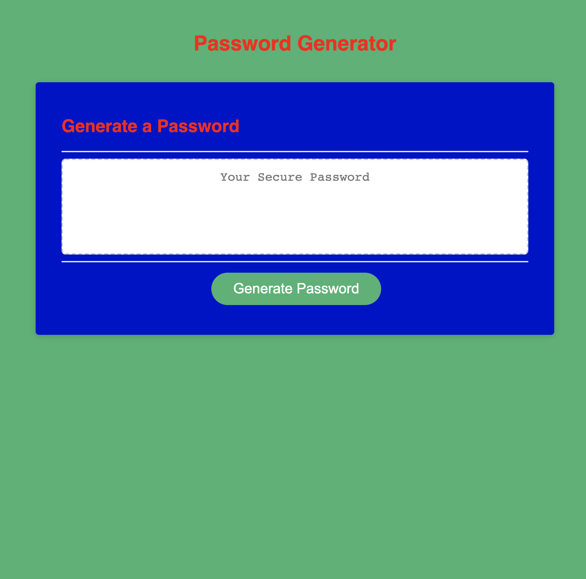

# JavaScript-Password-Generator

## Description
This Password Generator created with Javascript will generate a randomized password based on the users preference. The user can decide the length of the randomized password, and if the password should include numeric characters, uppercase letters, lowercase letters, and/or special characters. The user must press the generate button and will then recieve several prompts to guide them through the process.

## Built With
* HTML
* CSS
* Javascript

## Link to Deployed Application
https://osamadahnoun.github.io/JavaScript-Password-Generator/

## Screenshot of Deployed Application

## Contribution
JavaScript-Password-Generator created and designed with ❤️ by Osama Dahnoun